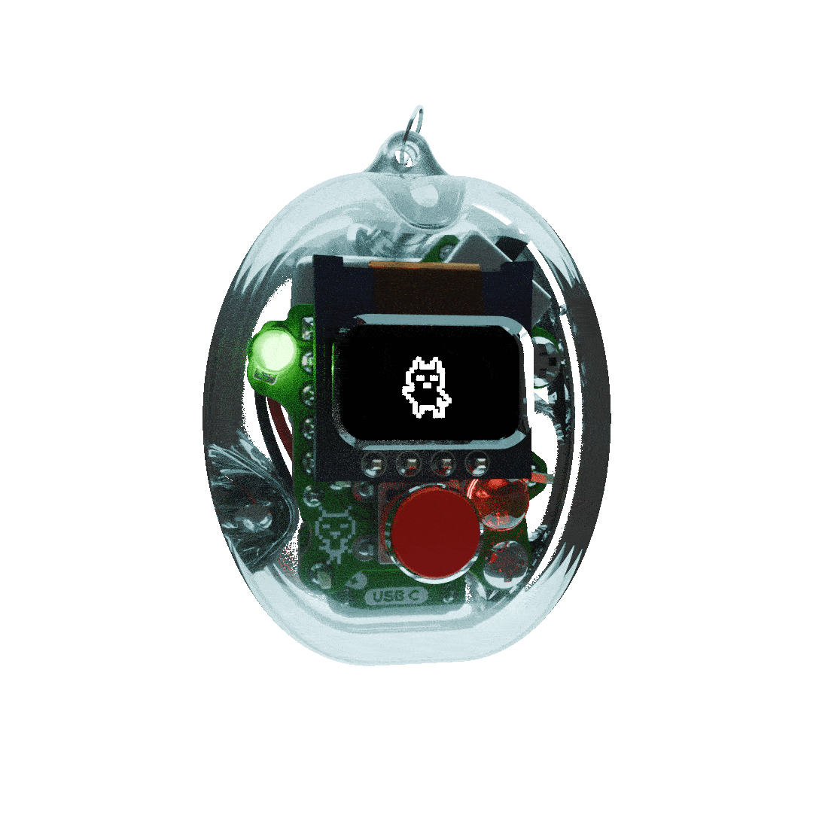
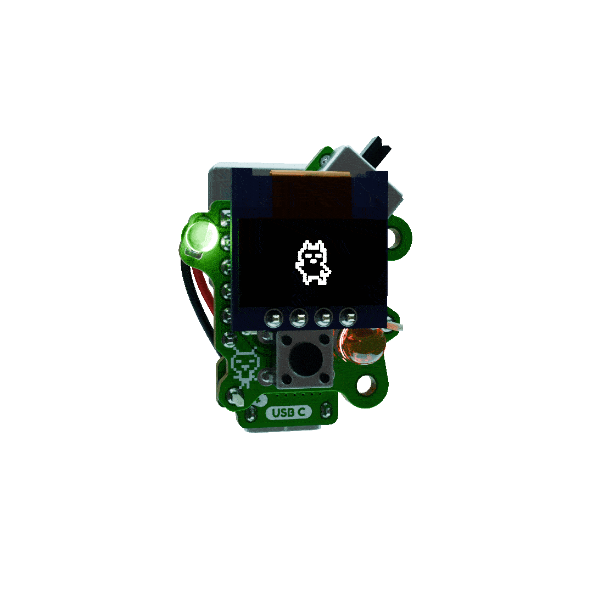

# Hello Tamo !

This is one of a few project I started to explore forming connections between digital and tactile objects. The hardware and software for Tamo is open source, although not well documented (yet!). 

### Here are some details about the project.

*The details:*

- Tamo currently runs on an ATtiny85, which is great because of its small size, low power consumption, and useful documentation. *Not* so great because of its small memory limitation (512B of RAM). In the future, I'm looking into integrating a larger processor like the CH32V203 or SAMD21 to give Tamo a little more capability as an art project.
- The case for Tamo is designed to be 3D printable using an FDM or SLA 3D printer, and is designed as two pieces which screw into one another and Tamo.
- The boards for Tamo were designed using [KiCad](), and design files are here in this repository.

