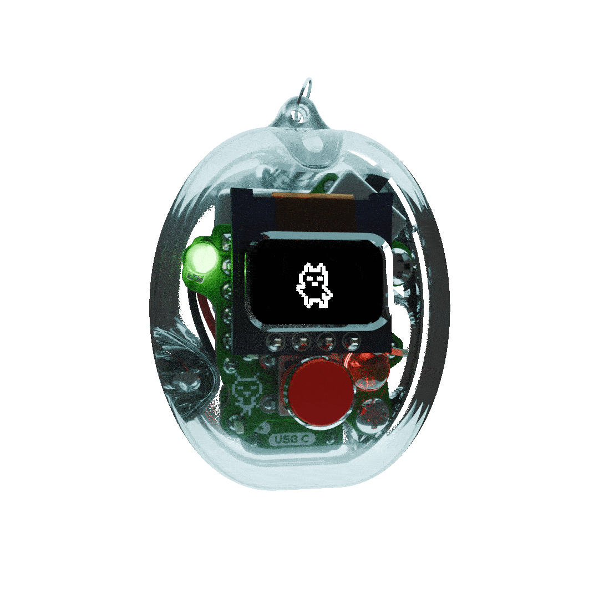
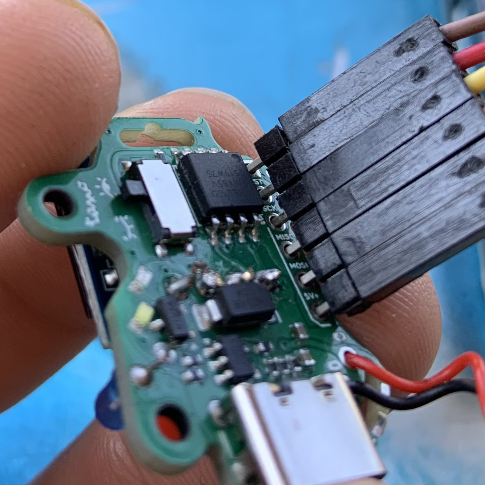
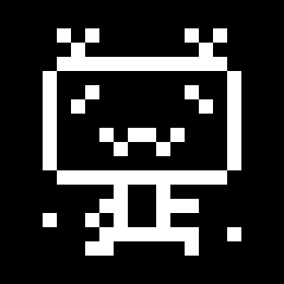

# (* _*) hello tamo ! (^ _^)



This is an art project I started to explore forming connections between digital and tactile objects. The hardware and software for Tamo is open source, although not well documented, so please feel free to reach out with questions!

## Infodump

The source code for Tamo is built using the [PlatformIO extension for VSCode](https://platformio.org/) and requires an ISP programmer to upload the code to the Tamo PCB.

### Programming Over ISP

By default, the PlatformIO project is configured to use an [Arduino board as the ISP programmer](https://docs.arduino.cc/built-in-examples/arduino-isp/ArduinoISP/) (more info [here](https://www.instructables.com/Turn-Your-Arduino-Into-an-ISP/) too), but any ISP programmer can work as long as the programming pins can be attached to 2.54mm pinheaders (or, soldered directly onto the Tamo PCB).


*layout of the ISP pins on the main board*

The programming pins of the ATTiny85 are broken out to a 2.54mm header on the side of the board. You can solder headers into this port, or just leave these unsoldered and gently press and hold the programming pins into the holes of the header while programming.


*The Arduino ISP Programmer I use, with the ISP pins broken out to a 2.54mm 6-pin header*



Pressing the pins into the programming port and tilting the connector a little usually gives enough electrical contact to program the board.

### Sprites
The sprite artwork is stored as .bmp images in the '/bitmaps' directory, which can be edited using an image editor (new bitmaps can also be added, but you might run out of space!). 



The 'bitmaps/compile_bitmaps.py' script iterates over each .bmp file and converts it toa PROGMEM byte array every time the code is compiled, so that the bitmap graphics are automatically updated with any changes made to images in the '/bitmaps' directory.

**Note: *every* '.bmp' file in the bitmaps directory will be added to the source code 'bitmaps.h' file, but bitmaps won't be included in the firmware by the compiler unless they're referenced in your code.**

### EEPROM

The EEPROM is used to store Tamo's identity so the same creature is retained when power is lost. When Tamo dies from malnutrition, though, its identity is reset and the EEPROM identity is rewritten. There isn't really a reason to modify this data, unless you wanted to start Tamo with a specific creature identity instead of getting one via the egg hatching process, or to add custom data into the EEPROM for other purposes.

```
BYTE 0 : CREATURE IDENTITY
0 == TAMO
1 == PORCINI
2 == BUG
3 == BOTO
255 == UNSET/NO IDENTITY
```

To modify the data that gets written to the ATTiny's EEPROM, overwrite/change the byte(s) inside 'eeprom_data.bin'. The EEPROM file is created from the '.bin' file using the custom 'eeprom/build_eeprom.py' script called by the PlatformIO build process, and the ATTiny EEPROM is written to during the upload process.

### BOM

If you're assembling Tamo from scratch, you'll need:


|Component|Quantity|Footprint|Link|
|---------|:------:|---------|----|
| **Main Board PCBA** |  |          |
|BSS83P MOSFET|1|SOT-23|||
|MCP73831T-2ACI/OT Charge Controller|1|SOT-23-5|||
|USB-C Connector|1|6P SMD |||
|LED|2 (different colors!)|SMD 0603|||
|SS14 Diode|1|SMA|||
|ATTiny85V-10P|1|SOIC-8||
|MSK12C02 Switch|1|SMD||
|10K Ohm Resistor|3|SMD 0402||
|5.1K Ohm Resistor|2|SMD 0402||
|4.7K Ohm Resistor|1|SMD 0402||
|470 Ohm Resistor|2|SMD 0402||
|10uF Capacitor|2|SMD 0402||
| **Hand Assembled Components** |  |          ||
|Push Switch|1|6mm SMD||
|Push Switch Button Cap|1|
|LED|2 (different colors!)|3mm THT|||
|64x32 0.49" OLED|1|4P Module|||
|100mAh 3.7V Lithium Battery (any capacity is okay! Only connect one cell to Tamo)|1|||||
|Main Board|1||
|Front Shell|1|
|Back Shell|1|
|3mm 2M screws|2|
|6mm 2M screws|2|

### Sources

The code for the display is a modified version of Datacute's [SSD1306 OLED Library](https://github.com/datacute/Tiny4kOLED) and uses the [Adafruit TinyWireM library](https://github.com/adafruit/TinyWireM) to communicate via I2C.

The PCBs for this project were designed in [KiCad](https://www.kicad.org/). The battery charging schematic is based on the schematic for Adafruit's [MicroLipo Battery Charger](https://github.com/adafruit/Adafruit-MicroLipo-PCB).
