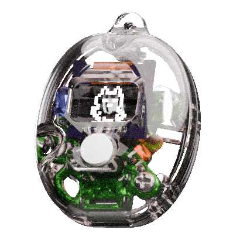
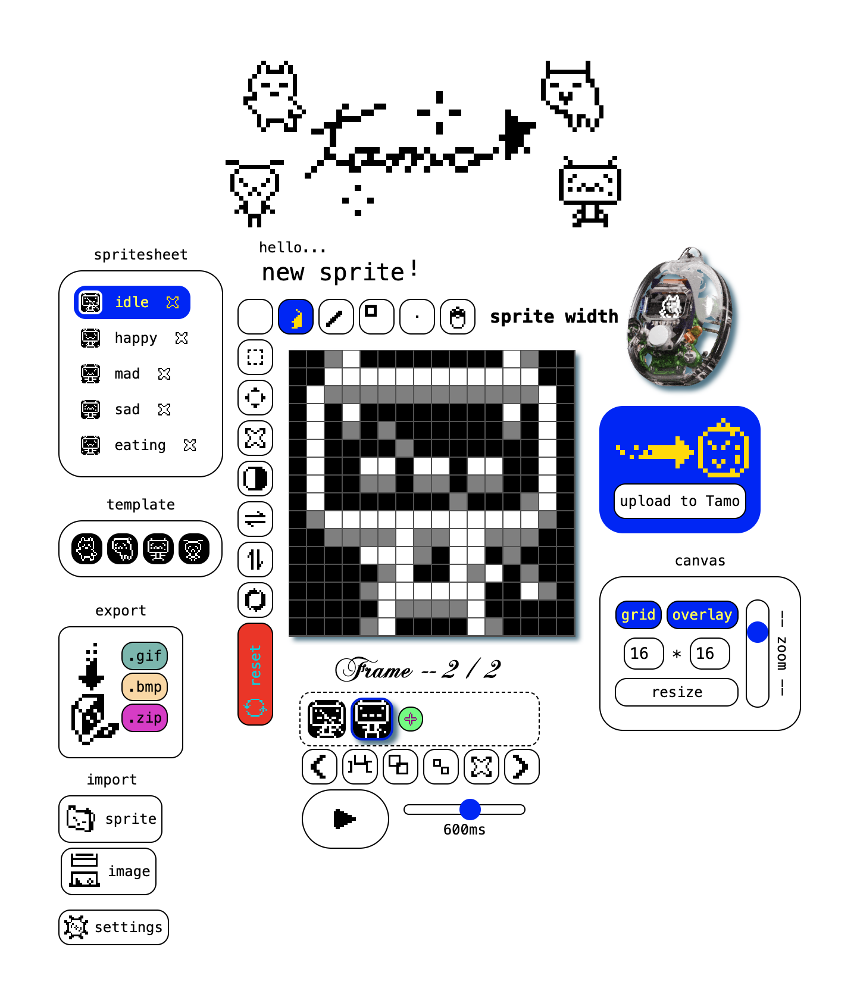
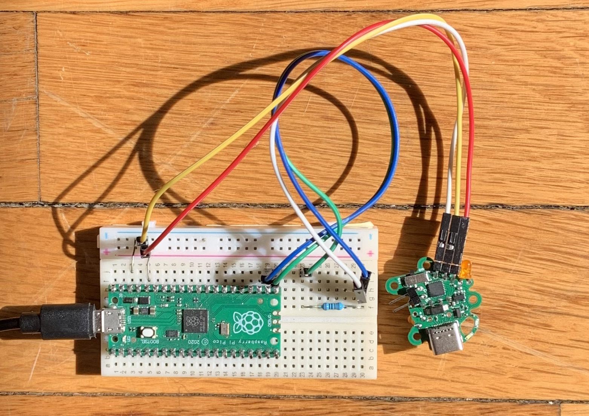

<div style = "display:flex">

</div>

<div style = "display:flex">

</div>

# About

This is an open source project I started to explore forming connections between digital and tactile objects. The hardware and software for Tamo is open source, although not well documented yet.

# Sprites

New creatures, foods, thoughts, & random art can be flashed to Tamo over USB using [Tamo's website](https://alexlafetra.github.io/tamo/).



TBD: Make a video tutorial walking through the site on youtube

# Firmware

Tamo's firmware is a PlatformIO project built around Spence Konde's [megaTinyCore](https://github.com/SpenceKonde/megaTinyCore) and the Arduino framework, with a modified build process to allow for in-system flash reprogramming so ***the Tamo source code can't be compiled/uploaded using the Arduino IDE!*** This project uses [PlatformIO](https://platformio.org/) for compiling with a [custom linker script](/tamo/linker/sprites.ld), running a few python scripts to export the EEPROM and bitmap data, and uploading to Tamo.


###### NOTE: I think there's a way to get this to work with the Arduino IDE by modifying the default linker scripts or creating a custom board, but it's not something I've experimented with.

The code for the display was originally based on Datacute's [SSD1306 OLED Library](https://github.com/datacute/Tiny4kOLED), but has been stripped down *and* augmented for this project.

To compile the bitmap .bmp's into C++ byte arrays, a python script iterates over all the .bmp's in the `/bitmaps` folder and writes a single large byte array to `spritesheet.h` along with preprocessor `#define's` marking the byte offset of each spritesheet. This is clunky, but space-efficient and works okay for right now.


# Uploading firmware

The Attiny3217 firmware is uploaded via a UPDI interface exposed on the motherboard. To upload, I use a tool called [pymcuprog](https://pypi.org/project/pymcuprog/) and a USB --> UPDI uploader.

In order to overwrite bitmap data, the Attiny3217 needs to store the data in the `APPCODE` section in memory and run the main code from the `BOOT` section. To do this, the BOOTEND and APPEND fuses have to be written to demarcate where the BOOT/APP boundary is in memory (and our custom linker script needs to place the spritesheet[] array into a region past BOOTEND). Setting the fuses happens separately from the UPDI uploaded process. To set them, run:

```
pymcuprog write --tool uart --device attiny3217 --uart {USB DEVICE PORT} --clk 230400 --memory fuses --offset 7 --literal 0x00 0x5E 
```
###### On Mac: The USB device will be something like ```/dev/cu.usbmodem14101```. Run ```ls /dev/tty.*``` in a terminal window to get a list of connected USB devices.

This will write the BOOTEND fuse (byte 8) to `0x5E` and the APPEND fuse (byte 7) to `0x00`, creating an APPCODE section starting at `0x5E` and filling up the rest of flash. To check that these fuses were written correctly, run:

```
pymcuprog read --tool uart --device attiny3217 --uart {USB DEVICE PORT} --clk 230400 --memory fuses
```

The last two bytes should be `0x00` and `0x5E`; `BOOTEND = 0x5E` allows code placed beyond the `0x5E` address to be overwritten by functions called from the BOOT section, and `APPEND = 0x00` sets all memory after BOOTEND to be in the APPCODE section.

Once these fuses written & checked you can upload code to the Attiny3217 as you normally would using PlatformIO and your UPDI programmer of choice. I use a Pi Pico running this [Pico UART Bridge](https://github.com/Noltari/pico-uart-bridge) project:



## BOM

The PCBs for this project were designed in [KiCad](https://www.kicad.org/). The battery charging schematic is based on the schematic for Adafruit's [MicroLipo Battery Charger](https://github.com/adafruit/Adafruit-MicroLipo-PCB).

If you're assembling Tamo from scratch, you'll need:

|Component|Quantity|Footprint|Link|
|---------|:------:|---------|----|
| **Main Board PCBA** |  |          |
|BSS83P MOSFET|1|SOT-23|||
|MCP73831T-2ACI/OT Charge Controller|1|SOT-23-5|||
|USB-C Connector|1|6P SMD |||
|LED|2 (different colors!)|SMD 0603|||
|SS14 Diode|1|SMA|||
|ATTiny85V-10P|1|SOIC-8||
|MSK12C02 Switch|1|SMD||
|10K Ohm Resistor|3|SMD 0402||
|5.1K Ohm Resistor|2|SMD 0402||
|4.7K Ohm Resistor|1|SMD 0402||
|470 Ohm Resistor|2|SMD 0402||
|10uF Capacitor|2|SMD 0402||
| **Hand Assembled Components** |  |          ||
|Push Switch|1|6mm SMD||
|Push Switch Button Cap|1|
|LED|2 (different colors!)|3mm THT|||
|64x32 0.49" OLED|1|4P Module|||
|100mAh 3.7V Lithium Battery (any capacity is okay! Only connect one cell to Tamo)|1|||||
|Main Board|1||
|Front Shell|1|
|Back Shell|1|
|3mm 2M screws|2|
|6mm 2M screws|2|
