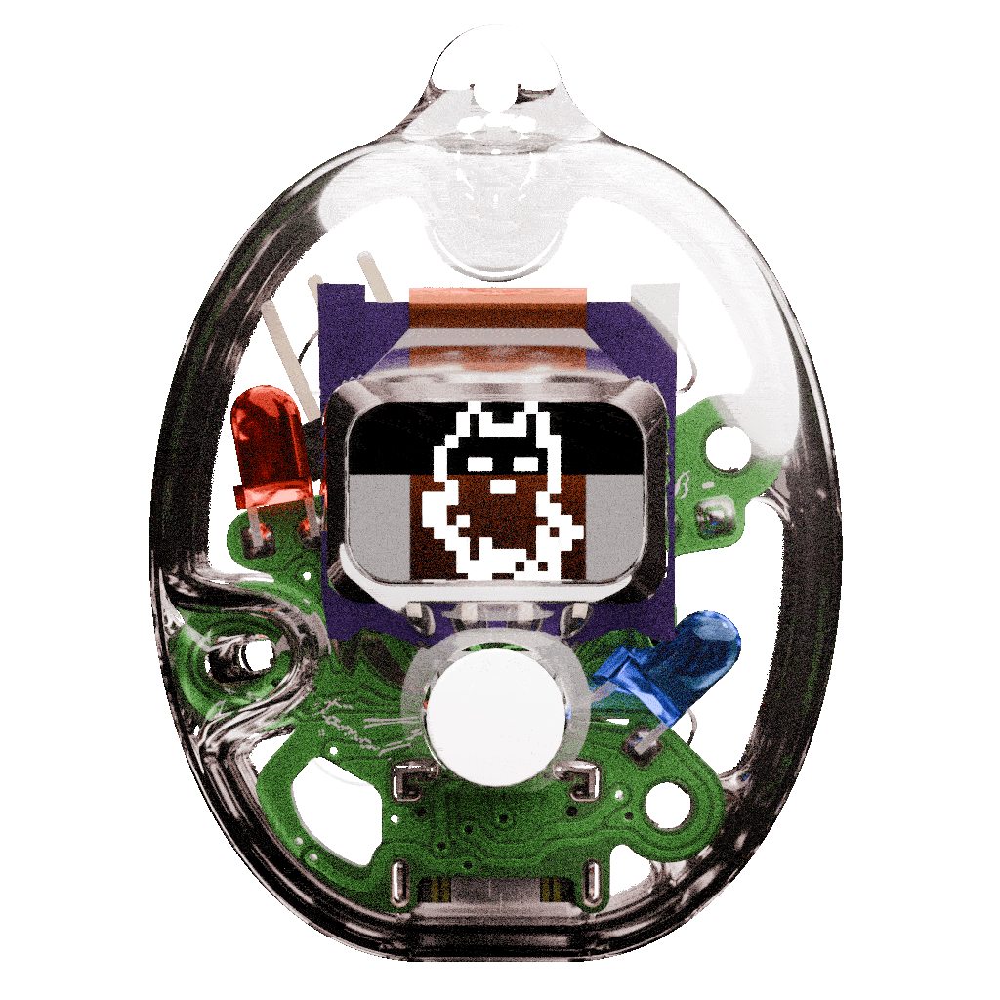

# Tamo

Tamo is an open source interdisciplinary hardware project designed to be both a piece of jewelry and a small person with complex emotions. This repo contains the firmware, hardware (PCB & 3D files), graphics, and web tools for the Tamo project.

### Modes

Tamo supports two modes: the default, "alive" mode and an "animation" mode: 

###### Animation
The animation mode is designed to supplement Tamo's usage as jewelry and is a very simple video player which can loop over up to 16 frames of video at different speeds.

###### Alive
Alive mode is the default mode for Tamo. While living, Tamo ages, feels things, gets hungry, dreams, and eventually dies. Tamo gets afflicted by different maladies


# Sprites
Tamo has a [custom sprite designer](https://alexlafetra.github.io/tamo/designer.html?sprite) for creating animations & character art for custom creatures. This tool is also useful for other pixel-art animations, and it's been used to create all the iconography and pixel art for the tamo project--have fun with it!


The mode & creature identity can be set, and new sprites can be flashed to Tamo over USB, using [Tamo's website](https://alexlafetra.github.io/tamo/).

# Firmware

Tamo's firmware is a PlatformIO project built around Spence Konde's [megaTinyCore](https://github.com/SpenceKonde/megaTinyCore) and the Arduino framework, with a modified build process to allow for in-system flash reprogramming so ***the Tamo source code can't be compiled/uploaded using the Arduino IDE!*** This project uses [PlatformIO](https://platformio.org/) for compiling with a [custom linker script](/tamo/linker/sprites.ld), running a few python scripts to export the EEPROM and bitmap data, and uploading to Tamo.


###### NOTE: There might be a way to get this to work with the Arduino IDE by modifying the default linker scripts or creating a custom board and a new fuse-upload setting--something that needs further development!

The code for the display was originally based on Datacute's [SSD1306 OLED Library](https://github.com/datacute/Tiny4kOLED), but has been stripped down and heavily augmented for this project.

A python script--`/bitmaps/compile_spritesheet.py`--automatically compiles any `.bmp` files inside the `/bitmaps` folder and inserts them into the spritesheet.

A second script--`/eeprom/build_eeprom.py`--creates a binary file with the default EEPROM values and writes it to the Attiny3217's EEPROM memory just after the firmware upload.


## Uploading firmware

The Attiny3217 firmware is uploaded via a UPDI interface exposed on the motherboard. [pymcuprog](https://pypi.org/project/pymcuprog/) and a USB --> UPDI uploader built from a Pi Pico has been used for development, but other USB UPDI uploader tools should work fine.

A Pi Pico running this [Pico UART Bridge](https://github.com/Noltari/pico-uart-bridge) project is a perfect option which only requires a resistor and a few jumper wires!


### Custom fuses

The upload process is fairly standard and would othewise be easy to do using the Arduino IDE ~except~ that a few fuse values need to be written to the Attiny3217 during upload.

In order to overwrite bitmap data during runtime (allowing you to store new artwork on Tamo without recompiling the firmware) the Attiny3217 needs to store the bitmap data in the `APPCODE` section of its memory while running the main code from the `BOOT` section.
To do this, the BOOTEND and APPEND fuses have to be written to demarcate where the BOOT/APP boundary is in memory (and our custom linker script needs to place the spritesheet data into a region past BOOTEND/inside APPCODE). Setting the fuses happens separately from the UPDI uploaded process, and so can't easily be done using the Arduino IDE/platformio's default upload procedure. To set these fuses using `pymcuprog`, run:

```
pymcuprog write --tool uart --device attiny3217 --uart {USB DEVICE PORT} --clk 230400 --memory fuses --offset 7 --literal 0x00 0x5E 
```
###### On Mac: The USB device will be something like ```/dev/cu.usbmodem14101```. Run ```ls /dev/tty.*``` in a terminal window to get a list of connected USB devices.

This will write the BOOTEND fuse (byte 8) to `0x5E` and the APPEND fuse (byte 7) to `0x00`, creating an APPCODE section from `0x5E` to the end of the flash memory. To check that these fuses were written correctly, run:

```
pymcuprog read --tool uart --device attiny3217 --uart {USB DEVICE PORT} --clk 230400 --memory fuses
```

The last two bytes should be `0x00` and `0x5E`; `BOOTEND = 0x5E` allows code placed beyond the `0x5E` address to be overwritten by functions called from the BOOT section, and `APPEND = 0x00` sets all memory after BOOTEND to be in the APPCODE section.

Once these fuses are written & checked you can upload code to the Attiny3217 as you normally would using PlatformIO and your UPDI programmer of choice.

## Hardware

The PCBs for this project were designed in [KiCad](https://www.kicad.org/). The battery charging schematic is based on the schematic for Adafruit's [MicroLipo Battery Charger](https://github.com/adafruit/Adafruit-MicroLipo-PCB).

<!-- 
If you're assembling Tamo from scratch, you'll need:

|Component|Quantity|Footprint|Link|
|---------|:------:|---------|----|
| **Main Board PCBA** |  |          |
|BSS83P MOSFET|1|SOT-23|||
|MCP73831T-2ACI/OT Charge Controller|1|SOT-23-5|||
|USB-C Connector|1|6P SMD |||
|LED|2 (different colors!)|SMD 0603|||
|SS14 Diode|1|SMA|||
|ATTiny85V-10P|1|SOIC-8||
|MSK12C02 Switch|1|SMD||
|10K Ohm Resistor|3|SMD 0402||
|5.1K Ohm Resistor|2|SMD 0402||
|4.7K Ohm Resistor|1|SMD 0402||
|470 Ohm Resistor|2|SMD 0402||
|10uF Capacitor|2|SMD 0402||
| **Hand Assembled Components** |  |          ||
|Push Switch|1|6mm SMD||
|Push Switch Button Cap|1|
|LED|2 (different colors!)|3mm THT|||
|64x32 0.49" OLED|1|4P Module|||
|100mAh 3.7V Lithium Battery (any capacity is okay! Only connect one cell to Tamo)|1|||||
|Main Board|1||
|Front Shell|1|
|Back Shell|1|
|3mm 2M screws|2|
|6mm 2M screws|2| -->
