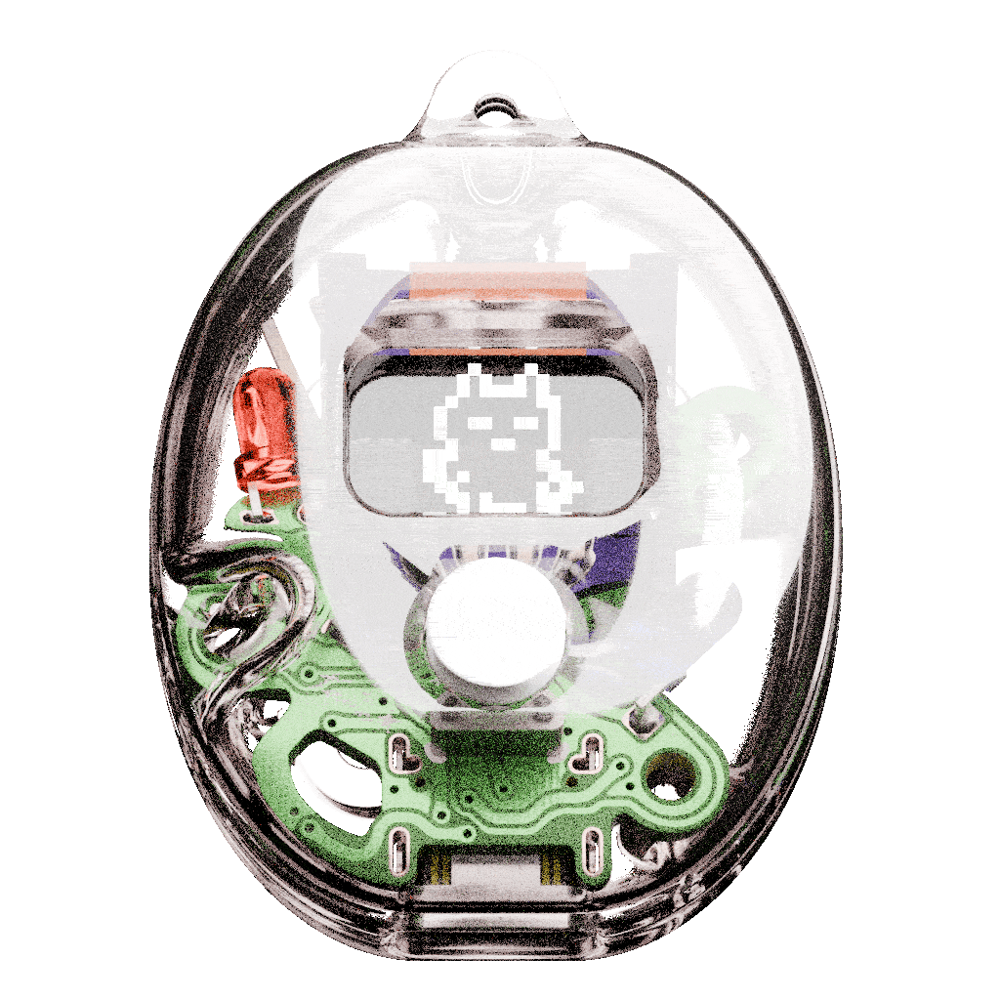
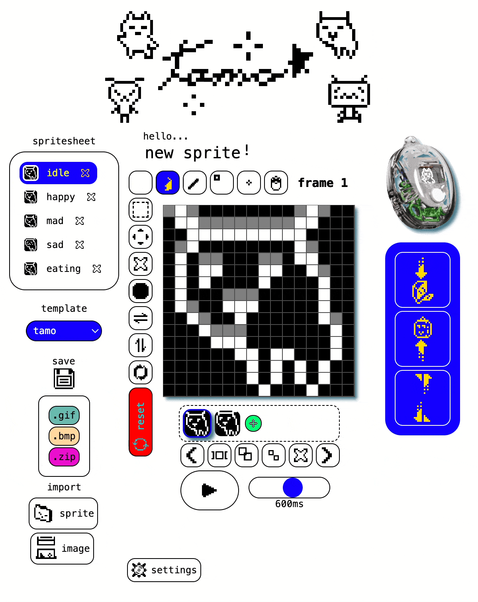

# Tamo

Tamo is an open source interdisciplinary hardware project designed to be both a piece of jewelry and a small being with (somewhat) complex emotions. This repository contains the firmware, hardware design (PCB & 3D files), graphics, and code for the web tools for sprite design and custom creature upload.




### Background

This project started as a way of making something that could be shared between people in my life that felt precious, but also mass-produced. It's designed to feel like it has an independent existence outside of just being your pet, like maybe it's "going through some shit," but also like you can effectively comfort it and have a connection to the creature inside Tamo.


### Modes

Tamo supports two modes: the default, "alive" mode and an "animation" mode: 

###### Animation
The animation mode is a very simple video player or slideshow which can loop over up to 16 frames of video at different speeds. It's designed more for tamo as a piece of jewelry, and doesn't feature any interaction other than turning tamo on/off with the main button.

###### Living
Living mode is the default mode for Tamo. While living, Tamo ages, speaks, gets hungry, gets happy, gets sad, gets angry, and eventually dies. Tamo can be afflicted by different maladies: a smoking habit, compulsive eating, mood swings, and depression. Tamo can be fed, talked to, or connected to another Tamo to swap places.


# Sprites
The [custom sprite designer](https://alexlafetra.github.io/tamo/designer.html?sprite) is a tool for creating animations & sprite art for tamo, which can be uploaded to the device using the browser and a USB-C cable.



The mode & creature identity can be set, and new sprites can be flashed to Tamo over USB, using [Tamo's website](https://alexlafetra.github.io/tamo/).

# Firmware

Tamo's firmware is a PlatformIO project built around Spence Konde's [megaTinyCore](https://github.com/SpenceKonde/megaTinyCore) and the Arduino framework, with a modified build process to allow for in-system flash reprogramming. This project uses [PlatformIO](https://platformio.org/) for compiling with a [custom linker script](/tamo/linker/sprites.ld) and to run a few python scripts that upload the EEPROM and custom fuses to the Attiny. Unfortunately, this project hasn't been ported to work as a standalone Arduino project, but this repository contains all the libraries and the platformio.ini file needed to setup the platformIO environment, hopefully making use of the platformIO extension for VSCode almost as beginner-friendly.

During compilation, a python script--`/scripts/compile_spritesheet.py`--automatically converts selected `.bmp` files inside the `/bitmaps` folder to C++ byte arrays and appends them to the main spritesheet array. The creature sprites selected by this script are randomly chosen each time from the 7 default creatures, so each tamo gets a different mix of sprite artwork to start with. Each of these creatures can be overwritten later, though.

A second script--`/scripts/build_eeprom.py`--builds a binary file with the default EEPROM values and writes it to the Attiny3217's EEPROM memory after the firmware upload.


## Uploading firmware

The Attiny3217 firmware is uploaded via its UPDI interface, which is exposed on the motherboard as three header pins (UPDI,GND, and VCC). For development, I've been using [pymcuprog](https://pypi.org/project/pymcuprog/) and this [Pico UART Bridge](https://github.com/Noltari/pico-uart-bridge) design to use a Pi Pico as a UPDI programmer and upload code to the Attiny. Any USB UPDI programmer should work, though!


###### Example of the Pico UART Bridge wired to the Tamo board's UPDI header pins as a programmer.

Although the UPDI headers are exposed on the board, the `SBU1/SBU2` pins on Tamo's USB-C jack are also both tied to the UPDI pin on the Attiny so the chip can be programmed using just a USB cable plugged into the USB-C port with the other end specially wired to a UPDI programmer. You'll need to make sure whatever cable you use for this carries the `SBU1/SBU2` lines, but this allows programming Tamo from inside its shell.

### A note about custom fuses & overwriteable flash

The Attiny has strict rules about which sections of flash memory can overwrite other sections -- code running in `BOOT` can overwrite `APPCODE` and `APPDATA` sections, but `BOOT` can never be overwritten (even by other code running from `BOOT`). By default, the *entire* memory of the Attiny is designated as the `BOOT` section, meaning the code uploaded to flash doesn't have permission to rewrite any part of the Attiny's memory.

So, to overwrite bitmap data during runtime (allowing the firmware to overwrite new artwork in the Attiny's flash without recompiling the firmware with new sprites) we need to ask the Attiny3217 to store the bitmap data in a section of its memory demarcated as `APPCODE` while still running the main code from the `BOOT` section. This just requires three things:

1. Creating a linker script which places the `spritesheet` variable containing all the bitmap data at a fixed memory address. This linker script is a copy of the default TinyMegaCore linker script, with a special section titled ".bitmap_data" added which has a specific, fixed address. 

2. The "spritesheet" variable in our C++ code needs a little linker flag to tell the linker to place it in that new ".bitmap_data" section:

```
const unsigned char spritesheet[]  __attribute__((section(".bitmap_data"))) = {
    ... DATA ...
};

```

2. Finally, the `BOOTEND` and `APPEND` fuses on the Attiny3217 need to be set during upload so that the `BOOT`/`APPCODE` partition is created, at the specific address of .bitmap_data, so that the .bitmap_data section is placed in `APPCODE`.

The addresses are written as `[APPEND page address, BOOTEND page address]` (the addresses values are actually the 256-byte *page* address, ie. 0x01 is byte 256, 0x02 is byte 512 etc.) For tamo, the `BOOTEND` fuse is set to `0x5E = 94`, meaning `94 x 256B = 24,064B` of flash is reserved for the main firmware running in `BOOT`, and the remaining ~8kB are used for bitmaps. The `APPEND` fuse is set to `0x00`, which tells the Attiny3217 to allocate the rest of flash from `BOOTEND` onwards for the `APPCODE` section.

To set these fuses using `pymcuprog`, run:

```
pymcuprog write --tool uart --device attiny3217 --uart {USB DEVICE PORT} --clk 230400 --memory fuses --offset 7 --literal 0x00 0x5E 
```
###### On Mac: The USB device will be something like ```/dev/cu.usbmodem14101```. Run ```ls /dev/tty.*``` in a terminal window to get a list of connected USB devices.

To read back the fuse values and check if they were written correctly, run:

```
pymcuprog read --tool uart --device attiny3217 --uart {USB DEVICE PORT} --clk 230400 --memory fuses
```

## Thank you's

This project is built with support from these other projects:

- [pymcuprog](https://pypi.org/project/pymcuprog/), for uploading and writing fuses via UPDI

- This [Pico UART Bridge](https://github.com/Noltari/pico-uart-bridge) project for building a custom UPDI programmer, so helpful!

- The code for the display was originally based on Datacute's [SSD1306 OLED Library](https://github.com/datacute/Tiny4kOLED), although now very heavily augmented

- The PCBs for this project were designed in [KiCad](https://www.kicad.org/) and specifically the battery charging schematic is based on the schematic for Adafruit's [MicroLipo Battery Charger](https://github.com/adafruit/Adafruit-MicroLipo-PCB)

